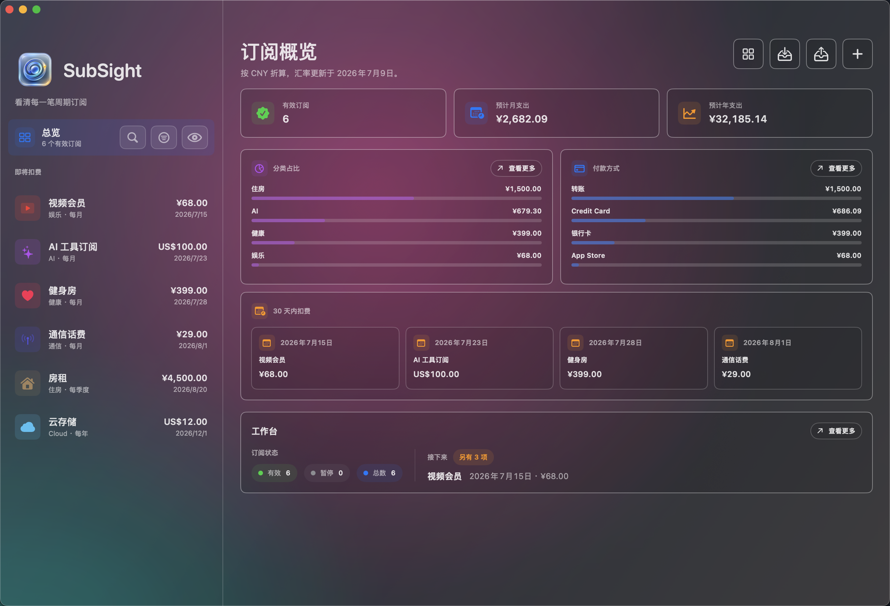
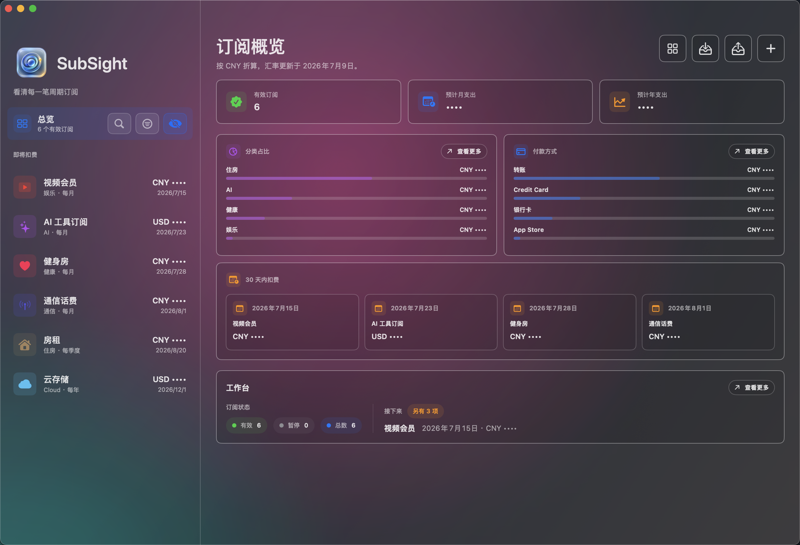

# SubSight

<p align="center">
    <a href="https://github.com/llwpll/SubSight/actions/workflows/ci.yml"></a>
    <a href="https://linux.do" alt="LINUX DO"></a>
</p>

[简体中文](README.md) | [English](README.en.md)

SubSight 是一款本地优先的 macOS 订阅管理应用，用来跟踪各类周期性付款。它可以帮你查看即将续费的项目、月度和年度成本、分类、付款方式、取消链接和备注，同时不会把你的订阅数据上传到服务器。

项目也包含一个命令行工具 `subsightctl`，可用于脚本、自动化流程，也方便 agent 通过命令录入订阅。

## 目录

- [截图](#截图)
- [功能](#功能)
- [系统要求](#系统要求)
- [安装 App](#安装-app)
- [安装 CLI](#安装-cli)
- [开始使用](#开始使用)
- [Agent 录入订阅方式](#agent-录入订阅方式)
- [CLI 常用命令](#cli-常用命令)
- [数据位置](#数据位置)
- [隐私说明](#隐私说明)
- [从源码开发](#从源码开发)
- [设计](#设计)
- [变更记录](#变更记录)
- [许可证](#许可证)

## 截图

以下截图使用示例数据。





## 功能

- 使用 SwiftUI 构建的原生 macOS 应用
- 订阅数据以本地 JSON 文件保存到 Application Support
- 添加、编辑、暂停、恢复和删除订阅
- 记录金额、币种、计费周期、下次扣费日期、分类、付款方式、账号提示、取消链接、备注、付款期数和结束日期
- 汇总活跃订阅、月度成本、年度成本、分类占比、付款方式占比和近期续费
- 菜单栏入口，快速查看即将扣费的项目
- 隐私模式，可在屏幕上隐藏敏感名称和金额
- 支持 CSV 和 JSON 导入/导出
- `subsightctl` CLI 支持 list、get、add、update、pause、resume、delete、summary、breakdown、rates、templates、import 和 export

## 系统要求

- macOS 15 或更高版本
- 如果要从源码构建，需要 Swift 6.1 或更高版本

## 安装 App

从 [GitHub Releases](https://github.com/llwpll/SubSight/releases) 下载 `SubSight-<version>-macos-app.zip`，解压后打开 App：

```sh
unzip SubSight-<version>-macos-app.zip
open SubSight.app
```

如果 macOS 首次打开时提示安全确认，可以在 Finder 中右键点击 `SubSight.app`，选择“打开”。

## 安装 CLI

从 [GitHub Releases](https://github.com/llwpll/SubSight/releases) 下载 `subsightctl-<version>-macos-<arch>.tar.gz`，解压并安装到 `PATH` 中的目录：

```sh
tar -xzf subsightctl-<version>-macos-<arch>.tar.gz
chmod +x subsightctl
mkdir -p ~/.local/bin
install -m 755 subsightctl ~/.local/bin/subsightctl
```

如果 `~/.local/bin` 还不在你的 `PATH` 里，可以添加到 zsh 配置：

```sh
echo 'export PATH="$HOME/.local/bin:$PATH"' >> ~/.zshrc
source ~/.zshrc
```

Apple Silicon + Homebrew 用户也可以安装到 `/opt/homebrew/bin`：

```sh
install -m 755 subsightctl /opt/homebrew/bin/subsightctl
```

从源码安装 CLI：

```sh
swift build -c release --product subsightctl
mkdir -p ~/.local/bin
install -m 755 .build/release/subsightctl ~/.local/bin/subsightctl
```

确认安装成功：

```sh
command -v subsightctl
subsightctl help
subsightctl list --json
```

## 开始使用

推荐的上手方式是让本地 agent 通过 `subsightctl` 录入订阅。安装 CLI 后，把下面的 [Agent 录入订阅方式](#agent-录入订阅方式) 指令发给 Codex、OpenClaw 或其他 agent，再用日常语言描述你的周期性支出。

如果你更喜欢手动操作，也可以打开 `SubSight.app`，点击右上角的添加按钮逐条录入。App 和 CLI 会共用同一个本地数据文件。

## Agent 录入订阅方式

Codex、OpenClaw 或其他本地 agent 都可以通过 `subsightctl` 录入订阅。只要 CLI 已经在 `PATH` 里，就不需要额外集成，也不需要让 agent 直接编辑数据文件。

可以给 agent 这样的指令：

```text
我接下来要整理订阅、账单和其他周期性支出。
请使用 `subsightctl` CLI 帮我记录到 SubSight。
不要直接编辑 `subscriptions.json`。
开始前先运行 `subsightctl list --json` 看看已有记录，避免重复添加。
我用自然语言描述支出时，请你推断金额、币种、周期、下次缴费日、分类和备注。
如果日期、币种或周期不明确，先问我确认。
每次添加或更新后，用 `subsightctl get --id <UUID> --json` 或 `subsightctl list --json` 验证结果。
```

你可以像这样对 agent 说：

```text
帮我记一下这些周期性支出：
通信话费 29 元一个月，每月 1 号缴费。
AI 工具订阅 100 美元一个月，上次缴费是 6 月 23 日。
房租按每月 1500 元计算，三个月交一次，上次是 5 月 20 日交的。
```

agent 应把自然语言转成 `subsightctl` 命令。例如，假设今天是 `2026-07-09`，上面的输入可以记录为：

```sh
subsightctl add \
  --name "通信话费" \
  --amount 29 \
  --currency CNY \
  --cycle monthly \
  --next 2026-08-01 \
  --category 通信 \
  --payment "自动扣费" \
  --notes "每月 1 号缴费"

subsightctl add \
  --name "AI 工具订阅" \
  --amount 100 \
  --currency USD \
  --cycle monthly \
  --next 2026-07-23 \
  --category AI \
  --payment "Credit Card" \
  --notes "上次缴费 2026-06-23，由 agent 通过 subsightctl 记录"

subsightctl add \
  --name "房租" \
  --amount 4500 \
  --currency CNY \
  --cycle quarterly \
  --next 2026-08-20 \
  --category 住房 \
  --payment "转账" \
  --notes "按每月 1500 元计算，三个月交一次；上次缴费 2026-05-20"

subsightctl due --days 30 --json
subsightctl summary --base CNY --json
subsightctl list --query 房租 --json
```

如果只是演示或给 agent 做隔离测试，可以把 CLI 指向单独的数据文件：

```sh
rm -f /tmp/subsight-agent-demo.json

SUBSIGHT_DATA_FILE=/tmp/subsight-agent-demo.json subsightctl add \
  --name "Demo Service" \
  --amount 20 \
  --currency USD \
  --cycle monthly \
  --next 2026-08-01
```

生产使用时不要设置 `SUBSIGHT_DATA_FILE`，这样 App 和 CLI 会共同使用默认的本地数据文件。

## CLI 常用命令

```sh
subsightctl list --json
subsightctl list --query chat --status active
subsightctl get --id <UUID> --json
subsightctl due --days 30 --json
subsightctl templates --json
```

添加和编辑订阅：

```sh
subsightctl add \
  --name "iCloud+" \
  --amount 6 \
  --currency CNY \
  --cycle monthly \
  --next 2026-08-01 \
  --category Cloud \
  --payment "App Store"

subsightctl update --id <UUID> --amount 12 --next 2026-09-01
subsightctl pause --id <UUID>
subsightctl resume --id <UUID>
subsightctl delete --id <UUID>
```

分析和导入导出数据：

```sh
subsightctl summary --base CNY --json
subsightctl breakdown --dimension category --base CNY --json
subsightctl breakdown --dimension payment --base CNY --json
subsightctl export-csv --output ~/Desktop/subsight.csv
subsightctl import-csv --input ~/Desktop/subsight.csv --replace
subsightctl export-json --output ~/Desktop/subsight.json
subsightctl import-json --input ~/Desktop/subsight.json --replace
subsightctl rates --base USD --quotes CNY,EUR,HKD
```

## 数据位置

默认情况下，App 和 CLI 共用这个文件：

```text
~/Library/Application Support/SubSight/subscriptions.json
```

测试、演示或自动化沙盒场景下，可以把 CLI/App 指向另一个文件：

```sh
SUBSIGHT_DATA_FILE=/tmp/subsight-demo.json subsightctl list --json
```

## 隐私说明

SubSight 会把订阅记录保存在本地，不会上传订阅名称、金额、账号提示、备注或取消链接。汇率查询会访问 `https://api.frankfurter.dev/v2/rates`，但只发送 `USD`、`CNY` 这样的币种代码。

## 从源码开发

```sh
swift test
Scripts/build-app.sh
open .build/SubSight.app
swift run subsightctl list --status all
```

构建 release 版本 App：

```sh
CONFIGURATION=release Scripts/build-app.sh
open .build/SubSight.app
```

## 设计

- [SubSight Design System](docs/SubSight-Design-System.md)

## 变更记录

版本更新记录见 [CHANGELOG.md](CHANGELOG.md)。

## 许可证

MIT。详见 [LICENSE](LICENSE)。
